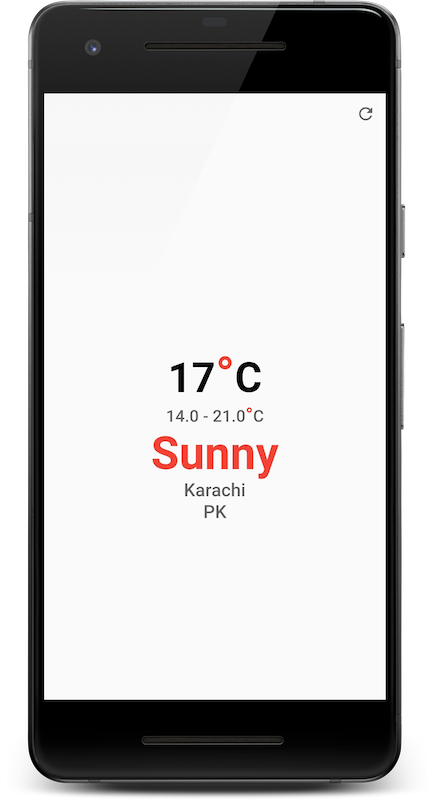

# Flutter Training - Session 3

Connecting with some sort of service which provides data is essential for almost any mobile app. In this session we learned about how to fetch data from internet using http calls.

## Description

This is a sample application demonstrating consumption of REST API which return weather releated data in .json format.

## Application

